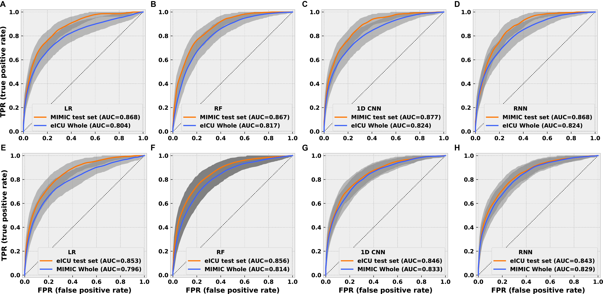

# METRE
This is the code repo for the paper: *Liao, Wei, and Joel Voldman. "A Multidatabase ExTRaction PipEline (METRE) for facile cross validation in critical care research." _Journal of Biomedical Informatics_ 141 (2023): 104356.* 

## 1. Prerequisites 
1).  Both database are hosted on Google Cloud and in order to have access, you can follow the instructions in the following links:  [MIMIV IV](https://physionet.org/content/mimiciv/2.2/) and [eICU](https://eicu-crd.mit.edu/about/eicu/)

2). Set up [Google Cloud](https://cloud.google.com/run/docs/setup) and have a billing project id ready. You can test if you can query MIMIC-IV and eICU database from Google Cloud by running the following test scripts:

    from google.colab import auth
    from google.cloud import bigquery
    import os
    auth.authenticate_user()

    project_id= ###YOUR OWN PROJECT ID###
    os.environ["GOOGLE_CLOUD_PROJECT"]=project_id
    client = bigquery.Client(project=project_id)

    def gcp2df(sql, job_config=None):
	    query = client.query(sql, job_config)
	    results = query.result()
	    return results.to_dataframe() 	
	    
    query = \ 	
    """ 		
        SELECT * 		
        FROM physionet-data.mimic_icu.icustays 		
        LIMIT 1000
    """
    patient = gcp2df(query)
    
## 2. File structure:

   - **./Resources/**: folder containing resource files used in the SQL queries
   
   - **./json_files/**: json files containing configurations such as outlier removal, variable order 

   - **./output/**: folder containing extracted tables
   
   - **./extract_sql.py**: SQL query scripts

   - **./extraction_utils.py**: funtions used to organize SQL-queried results 
   
   - **./extract_database.py**: extraction scripts to concat and clean query results

   - **./main.py**: main function to run

   - **./training/**: folder containing files in order to train the baseline tasks using the extracted data as well as to perform various model validation

    
## 3. MIMIC-IV and eICU Extraction
Once the data access and Google Cloud is set up, you can start extracting the data. 

1). Under the default setting, you can run the following command and specify your  Google Cloud id:

    python main.py --database MIMIC --project_id xxx
 And 
 

    python main.py --database eICU --project_id xxx
The default eICU extraction will use mean and std from MIMIC to perform z score, to change this:

    python main.py --database eICU --project_id xxx --norm_eicu eICU

 2). If you want to apply a different age and ICU length of stay filtering, simply run:
 

    python main.py --database MIMIC --project_id xxx --age_min 40 --los_min 12 --los_max 72

 3). If you want to skip the default outlier removal:

    python main.py --database MIMIC --project_id xxx --no_removal

 4). If you want to end the pipeline only after raw record being extracted without further cleaning:
 

    python main.py --database MIMIC --project_id xxx --exit_point Raw
    
 5). If you want to use a specific cohort, such as patients with congestive heart failure (CHF):
 

    python main.py --database MIMIC --project_id xxx --patient_group CHF
6). If none of the patient groups satisfies your requirement , you can save a custom id file use and use:

    python main.py --database MIMIC --project_id xxx --custom_id --customid_dir ./my_group.csv
7). If you want to specify a different time winddow (by hour):

    python main.py --database MIMIC --project_id xxx --time_window 2

## 4. Training and cross validation 

In training Logistic Regression (LR) and Random Forest (RF) models, we used Baysian Optimization. For the library we used, please refer to [Bayesian Optimization](https://github.com/fmfn/BayesianOptimization). For code to reproduce the results, please go to ./training folder. We also want to note that the MIMIC-IV is still updating. As of Feb 13 2023, its version is MIMIC-IV 2.2. So it's likely there could be some changes in the modeling results in the future. 

In order to train the TCN model (channel dimenstions [256, 256, 256, 256]), on hospital mortality task with 48h data and 6h gap, simple run: 

    python main.py --dataset_path xxx --dataset_path_cv xx --model_name TCN --num_channels 256 256 256 256 --thresh 48 --target_index 0 --gap 6 
To run a LSTM model for the 12h ARF task, run 

    python main.py --dataset_path xxx --dataset_path_cv xx --model_name RNN --thresh 12 --target_index 1

## 5. Results on in-hospital mortality prediction 

